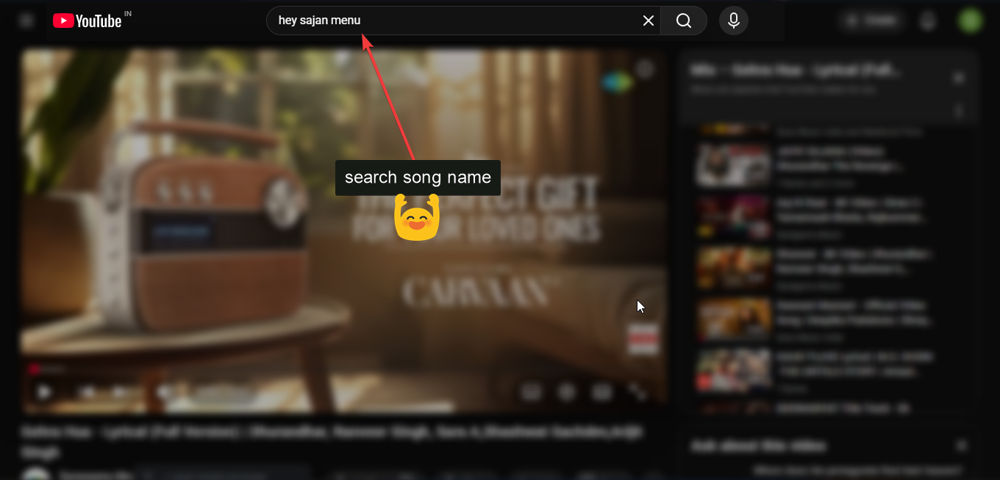
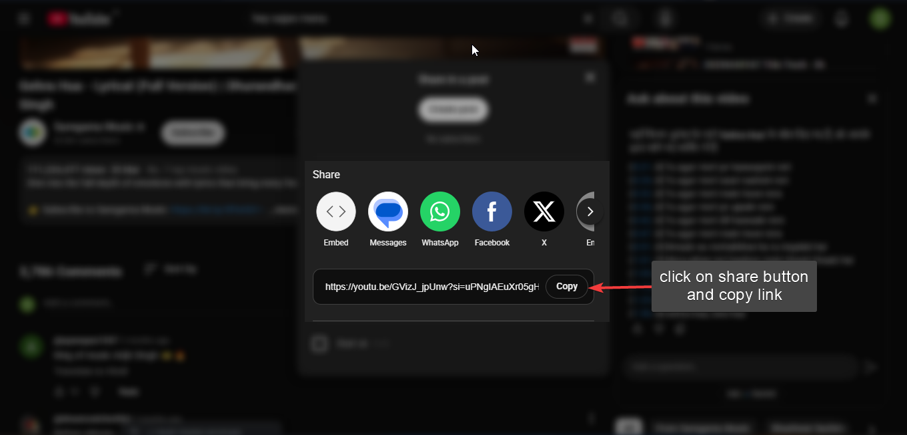
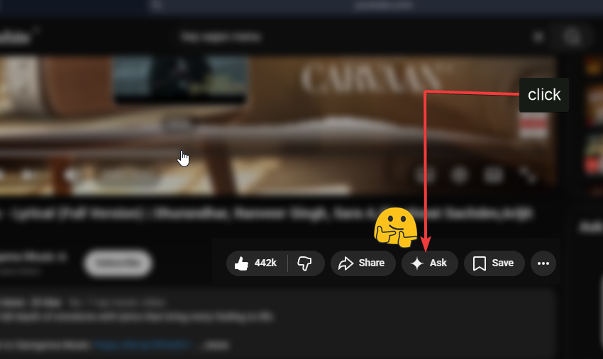
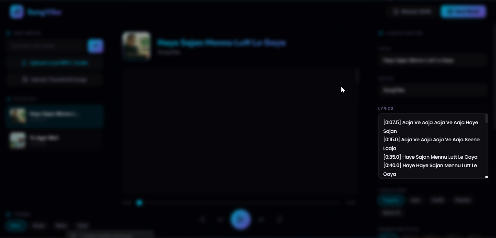
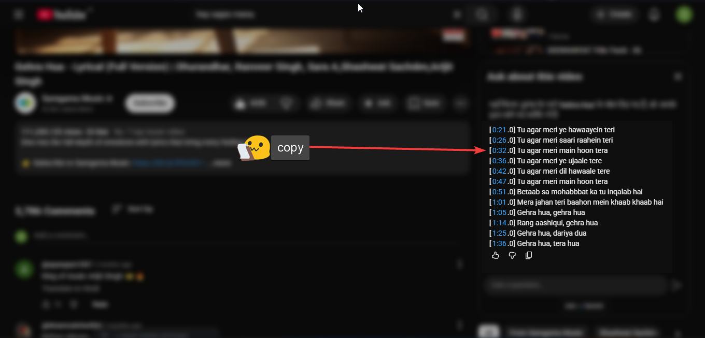
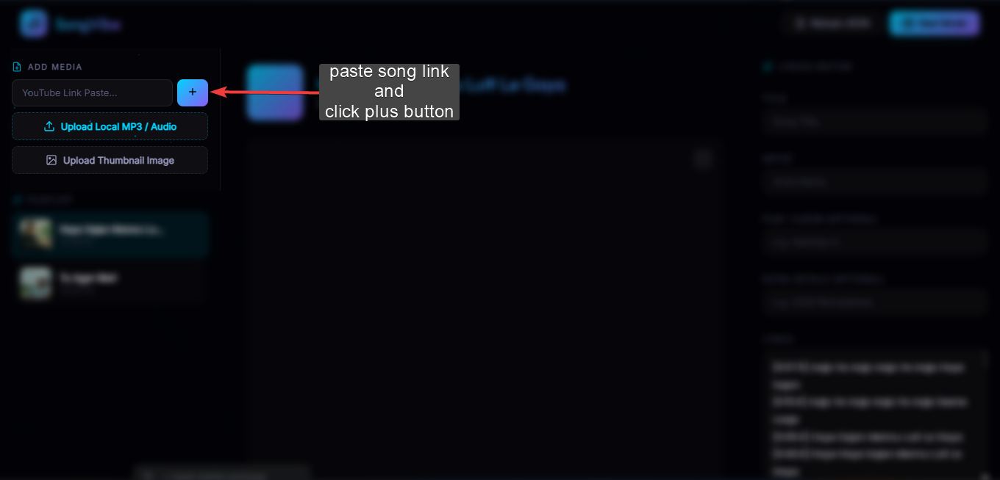
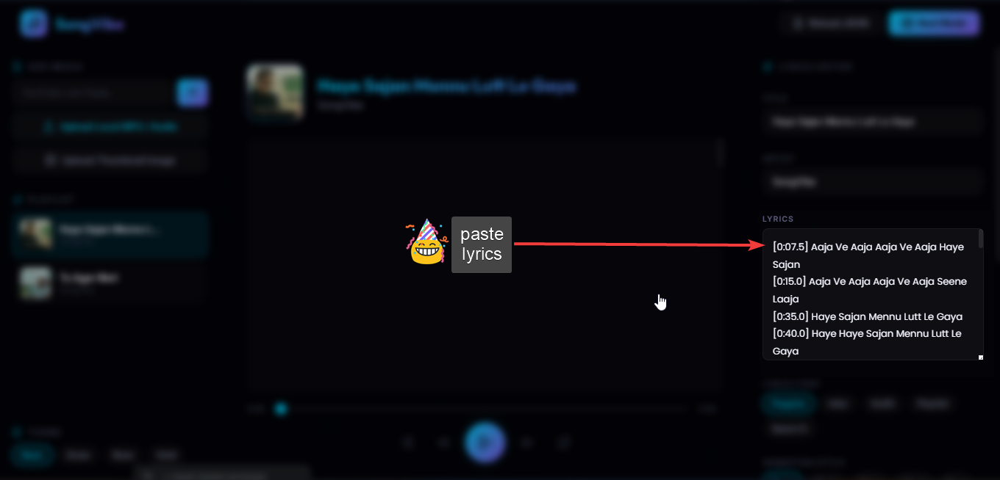
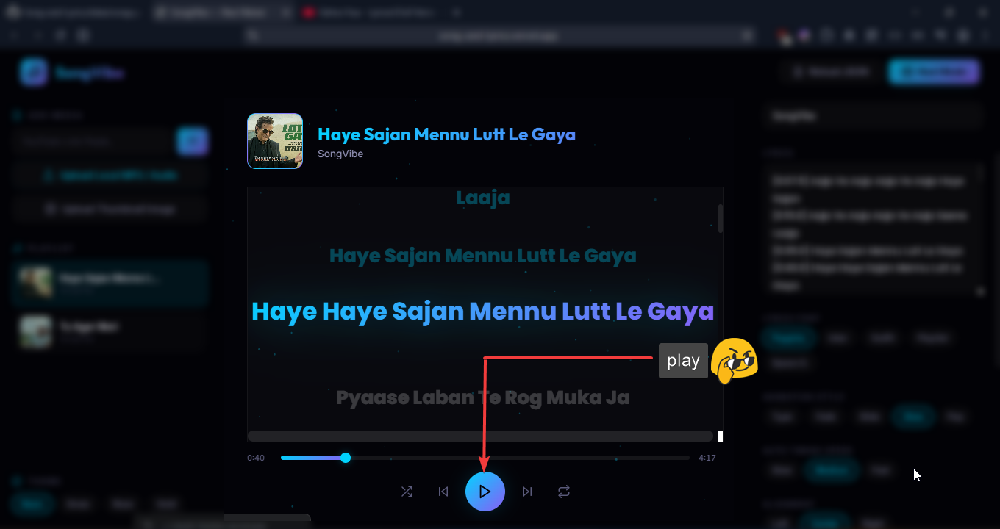

# 🎵 SongVibe Ultimate Pro

Welcome to **SongVibe Ultimate Pro** – The most advanced web-based Lyric Video & Reel Maker. 
This tool lets you sync, customize, and record breathtaking lyric videos natively in your browser with zero delay.

---

## 🚀 Production Features
- **Smart Audio Wave Sync:** Procedural audio visualizer that perfectly bounces and syncs with the lyrics in real-time.
- **Smart Auto-Scroll Focus:** The active lyric line is always dynamically centered on the screen. Manual scrolling is supported with a 3-second auto-resume timer.
- **Cinematic Text Animations (22+ Options):** Choose from Typewriter, Fade Up, Slide In, Pop In, Blur Drop, Glitch, Neon Flash, Wave, Ken Burns, Glow Pulse, and many more.
- **Premium Animated Themes:** Animated moving gradients for Midnight Mesh, Deep Ocean, Vaporwave, Sunset, Rose Gold, Neon Dark, and the classic Spotify Green.
- **Dual Language Font Engine:** Automatically detects Hindi (`Yatra One`) and English (`Poppins`) characters in the same song and renders them with beautiful contrasting typography.
- **Spotify-Style Real-time Typing:** Word-by-word karaoke-style text fill that syncs smoothly with the music cadence.
- **Advanced Customization Panel:** Manual sliders for Lyrics Size, Neon Glow intensity, Alignment (Left/Center/Right), and Vertical Positioning (Top/Middle/Bottom).
- **YouTube Restriction Detector:** Seamlessly handles official YouTube videos that block embedding and alerts the user to use an alternative link.

---

## 📸 Step-by-Step Visual Guide (How to Use)

Follow these simple steps to extract time-synced lyrics directly from YouTube using Gemini and play them in SongVibe!

### Step 1: Find your song
Search for your song name on YouTube.


### Step 2: Copy the Link
Click on the **Share** button and copy the YouTube link.


### Step 3: Ask Gemini
Click on the **"Ask"** ✨ button (Gemini integration in YouTube).


### Step 4: Request Timestamps (Use these Prompts)
Copy one of the prompts below based on your preferred language and paste it into Gemini. This will force Gemini to give you a perfectly color-coded, time-synced JSON block that you can directly paste into your app!

**For Hinglish Lyrics (Recommended)**
```text
Is YouTube video gaane ke pure lyrics Hinglish (English alphabet mein Hindi) mein nikal kar do. 
Mujhe output ek valid JSON format mein chahiye, jisme "title", "artist", "youtubeUrl", aur "lyrics" ho.
"lyrics" ek array of strings hona chahiye.
Har string is format mein honi chahiye: "[M:SS.S] [#hexcolor] lyric text".
Gaane ke mood ke hisaab se har line ke liye alag alag vibrant HEX colors use karna (jaise #ff4444, #00ffcc, #ffaa00).
Sirf aur sirf valid JSON block do taaki main seedha copy paste kar saku.
```

**For Pure Hindi Lyrics (Devanagari)**
```text
Is YouTube video gaane ke pure lyrics Hindi font (Devanagari) mein nikal kar do. 
Mujhe output ek valid JSON format mein chahiye, jisme "title", "artist", "youtubeUrl", aur "lyrics" ho.
"lyrics" ek array of strings hona chahiye.
Har string is format mein honi chahiye: "[M:SS.S] [#hexcolor] lyric text".
Gaane ke mood ke hisaab se har line ke liye alag alag vibrant HEX colors use karna (jaise #ff4444, #00ffcc, #ffaa00).
Sirf aur sirf valid JSON block do taaki main seedha copy paste kar saku.
```

**For English Lyrics**
```text
Extract the full lyrics of this YouTube video song in English. 
Provide the output as a valid JSON object containing "title", "artist", "youtubeUrl", and "lyrics".
The "lyrics" must be an array of strings.
Each string must follow this exact format: "[M:SS.S] [#hexcolor] lyric text".
Assign a different vibrant HEX color to each line based on the mood of the song (e.g., #ff4444, #00ffcc, #ffaa00).
Output strictly a valid JSON block so I can copy and paste it directly.
```


### Step 5: Copy the Lyrics
Highlight and copy the perfectly time-synced lyrics provided by Gemini.


### Step 6: Add to SongVibe
Go to SongVibe. Under **ADD MEDIA**, paste the YouTube link you copied earlier and click the **`+`** button.


### Step 7: Paste the Lyrics
In the right sidebar (Lyrics Editor), paste the lyrics you copied from Gemini into the large text box.


### Step 8: Play and Enjoy!
Click the **Play** button at the bottom of the screen. Your lyrics will perfectly sync with the music! You can now hit the Fullscreen button and record your Reel.


---
*Built with ❤️ by SongVibe*
